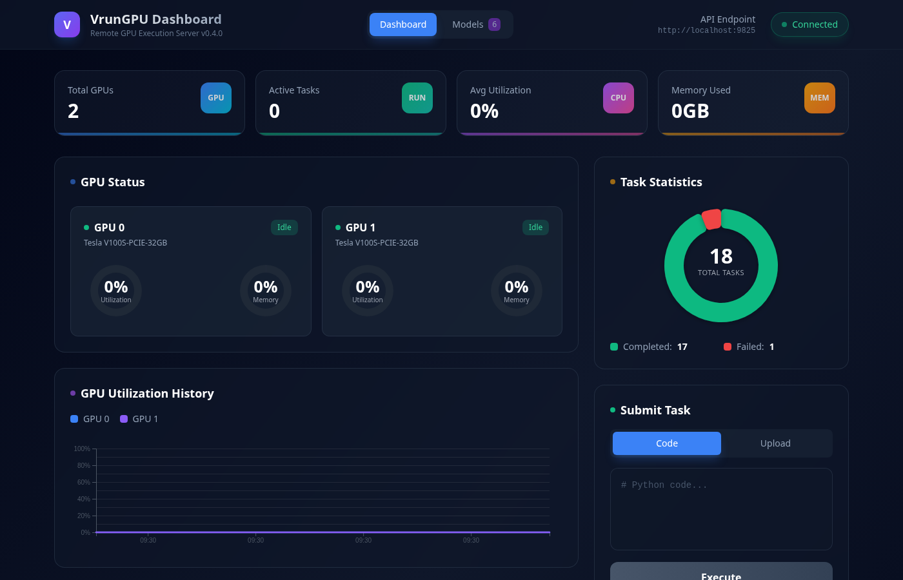

# VrunGPU

Remote GPU execution server for training and inference. Send Python code from your laptop to a GPU server via REST API and get results back.

[](https://opensource.org/licenses/Apache-2.0)



### Demo Video

[](https://youtu.be/NhjQtNnod5o)

## Features

- **Sync/Async Execution**: Sync for quick tasks, async for long training jobs
- **Multi-GPU Support**: Automatic job distribution across multiple GPUs
- **ZIP Project Upload**: Upload multiple Python files + datasets as a ZIP archive
- **File Upload API**: Streaming multipart upload for datasets/checkpoints — no base64 embed workaround
- **WebSocket Streaming**: Real-time training logs via WebSocket
- **Web Dashboard**: Visual monitoring of GPU status and tasks (D3.js charts)
- **SQLite Persistence**: Task and model data survives server restarts
- **Model Registry**: Register, query, and download trained models
- **Inference API**: Run inference on registered models
- **Progress Tracking**: Real-time training progress monitoring
- **LLM Chat API**: Built-in LLM inference service (Qwen2.5/Qwen3/Qwen3.5, Vision-Language)
- **Fine-Tuning**: SFT LoRA + DPO (RLHF) with TRL DPOTrainer, V100-compatible fp16
- **Session Management**: Server-side multi-turn chat sessions with TTL
- **Auto GPU Switching**: LLM and training jobs share GPU automatically

## Who is this for?

- **ML engineers** who want quick GPU experiments without infrastructure overhead
- **Small teams** prototyping before building full MLOps pipelines
- **Researchers** running ad-hoc experiments on remote GPU servers
- **Anyone** tired of the SSH → git pull → run → copy results workflow

### When to use VrunGPU vs MLOps platforms

| Scenario | MLOps Platforms | VrunGPU |
|----------|----------------|---------|
| Quick experiments / prototyping | Heavy setup overhead | ✅ Lightweight |
| Ad-hoc GPU tasks | Pipeline setup required | ✅ Instant execution |
| Small teams / individuals | Infrastructure cost | ✅ Minimal setup |
| Production deployment | ✅ Recommended | Not designed for |
| CI/CD pipelines | ✅ Recommended | Not designed for |
| A/B testing / Feature stores | ✅ Recommended | Not designed for |

### Where VrunGPU fits in your ML workflow

```
ML Development Lifecycle:

[Idea] → [Experiment] → [Development] → [Production]
              ↑               ↑               ↑
          VrunGPU         VrunGPU          MLOps
        (quick tests)   (iteration)    (deployment)
```

> **Note:** VrunGPU complements MLOps platforms by providing a lightweight execution layer for experimentation and development phases.

## Quick Start

### Installation

```bash
# Clone the repository
git clone https://github.com/maior/vrungpu.git
cd vrungpu

# Create virtual environment
python3 -m venv .venv
source .venv/bin/activate

# Install dependencies
pip install -r requirements.txt

# Install PyTorch with CUDA
pip install torch --index-url https://download.pytorch.org/whl/cu121

# Install dashboard (optional)
cd dashboard && npm install && npm run build
```

### Running the Server

```bash
# Start backend (port 9825)
.venv/bin/python server.py

# Start dashboard (port 9824)
cd dashboard && npm run start -- -p 9824
```

### Access Points

| Service | URL |
|---------|-----|
| Backend API | http://your-server:9825 |
| Dashboard | http://your-server:9824 |
| API Docs (Swagger) | http://your-server:9825/docs |

---

## Usage Examples

### 1. Check Server Status

```bash
curl http://your-server:9825/
```

```json
{
  "service": "VrunGPU",
  "status": "running",
  "version": "0.4.0",
  "gpu_count": 2,
  "available_gpus": 2,
  "total_tasks": 150,
  "total_models": 10
}
```

### 2. Synchronous Execution (Quick Tasks)

```bash
curl -X POST http://your-server:9825/run/sync \
  -H "Content-Type: application/json" \
  -d '{
    "code": "import torch\nprint(torch.cuda.get_device_name(0))"
  }'
```

### 3. Asynchronous Execution (Long Training)

```bash
# Submit job - runs until completion (no timeout by default)
curl -X POST http://your-server:9825/run/async \
  -H "Content-Type: application/json" \
  -d '{
    "code": "import time\nfor i in range(10):\n    print(f\"Step {i+1}/10\")\n    time.sleep(1)"
  }'

# Response: {"task_id": "abc-123", "status": "pending", ...}

# Check status
curl http://your-server:9825/task/abc-123
```

> **Note:** By default, tasks run without timeout. Training can run for hours or days. To set a timeout, add `"timeout": 3600` (seconds).

### 4. Specify GPU

```bash
curl -X POST http://your-server:9825/run/sync \
  -H "Content-Type: application/json" \
  -d '{
    "code": "import torch\nprint(f\"Running on GPU: {torch.cuda.current_device()}\")",
    "gpu_id": 1
  }'
```

---

## Progress Tracking

Report training and evaluation progress from your code and monitor it in real-time.

### Progress Output Format

```python
# Print progress in this format from your code
print(f"[PROGRESS:{progress_percent}:{message}]")
```

### Example: Training + Evaluation Progress

```python
import torch
import torch.nn as nn

# === Training Phase (0-85%) ===
print("[PROGRESS:0:Training started]")

num_epochs = 3
for epoch in range(1, num_epochs + 1):
    for batch_idx, batch in enumerate(train_loader):
        # Training logic...
        loss = train_step(batch)

        # Report every 100 batches
        if batch_idx % 100 == 0:
            progress = int((epoch - 1 + batch_idx / len(train_loader)) / num_epochs * 85)
            print(f"[PROGRESS:{progress}:Epoch {epoch} Batch {batch_idx}, Loss: {loss:.4f}]")

# === Evaluation Phase (85-95%) ===
print("[PROGRESS:85:Evaluating...]")
model.eval()

with torch.no_grad():
    for batch_idx, batch in enumerate(eval_loader):
        # Evaluation logic...
        evaluate_step(batch)

        # Report every 10 batches
        if batch_idx % 10 == 0:
            progress = 85 + int((batch_idx + 1) / len(eval_loader) * 10)
            print(f"[PROGRESS:{progress}:Eval {batch_idx+1}/{len(eval_loader)}]")

# === Save Model (95-100%) ===
print("[PROGRESS:95:Saving model...]")
torch.save(model.state_dict(), "model.pt")

print("[PROGRESS:100:Training complete!]")
```

**Recommended Progress Allocation:**
| Phase | Progress Range | Description |
|-------|---------------|-------------|
| Training | 0-85% | Main training loop |
| Evaluation | 85-95% | Validation/test evaluation |
| Saving | 95-100% | Model checkpoint & results |

### Query Progress

```bash
curl http://your-server:9825/task/{task_id}
```

Response:
```json
{
  "task_id": "abc-123",
  "status": "running",
  "progress": 60.0,
  "progress_message": "Epoch 6/10, Loss: 0.0234",
  "task_type": "training"
}
```

---

## Model Management

### Register a Model

```bash
curl -X POST http://your-server:9825/model/register \
  -F "name=mnist-classifier-v1" \
  -F "model_file=@model.pt" \
  -F "model_type=classifier" \
  -F "framework=pytorch"
```

Response:
```json
{
  "model_id": "a1b2c3d4",
  "name": "mnist-classifier-v1",
  "model_type": "classifier",
  "framework": "pytorch",
  "status": "ready",
  "file_size": 12345,
  "created_at": "2026-01-05T12:00:00"
}
```

### List Models

```bash
curl http://your-server:9825/models
```

### Get Model Details

```bash
curl http://your-server:9825/model/{model_id}
```

### Download Model

```bash
curl -O http://your-server:9825/model/{model_id}/download
```

### Delete Model

```bash
curl -X DELETE http://your-server:9825/model/{model_id}
```

---

## Inference API

Run inference on registered models.

### Execute Inference

```bash
curl -X POST http://your-server:9825/model/{model_id}/inference \
  -H "Content-Type: application/json" \
  -d '{
    "input_data": {"image": "base64...", "batch_size": 1},
    "timeout": 60
  }'
```

Response:
```json
{
  "task_id": "inference-xyz",
  "status": "pending",
  "message": "Inference task started. Model: mnist-classifier-v1"
}
```

### Get Inference Results

```bash
curl http://your-server:9825/task/{task_id}
```

---

## LLM Chat API

Built-in LLM inference service with **multi-GPU support**. Run different (or same) models on each GPU simultaneously. Supports Qwen2.5/Qwen3/Qwen3.5, Vision-Language, DeepSeek, GPT-OSS models.

### Supported Models

Model aliases (short names) are accepted wherever a model name is expected.

| Model | Alias | HuggingFace Name | VRAM (FP16) | Note |
|-------|-------|------------------|-------------|------|
| Qwen3.5-9B | `qwen3.5-9b` | `Qwen/Qwen3.5-9B` | ~18GB | Default, fine-tuning ready |
| Qwen2.5-7B | `qwen2.5-7b` | `Qwen/Qwen2.5-7B-Instruct` | ~16GB | |
| Qwen2.5-VL-7B | `qwen2.5-vl-7b` | `Qwen/Qwen2.5-VL-7B-Instruct` | ~16GB | Vision-Language (use `/run/async`) |
| Qwen3-8B | `qwen3-8b` | `Qwen/Qwen3-8B` | ~18GB | |
| DeepSeek-R1-7B (Qwen) | `deepseek-7b` | `deepseek-ai/DeepSeek-R1-Distill-Qwen-7B` | ~16GB | |
| DeepSeek-R1-8B (Llama) | `deepseek-8b` | `deepseek-ai/DeepSeek-R1-Distill-Llama-8B` | ~18GB | |
| DeepSeek-R1-14B | `deepseek-14b` | `deepseek-ai/DeepSeek-R1-Distill-Qwen-14B` | ~28GB | V100 32GB recommended |
| GPT-OSS-20B | `gpt-oss-20b` | `openai/gpt-oss-20b` | ~41GB | MXFP4 → BF16 dequant for V100 |

### Start LLM Service

Each GPU runs an independent inference server (port = 9826 + gpu_id). You can run different or the same models on multiple GPUs simultaneously.

```bash
# Start model on GPU 0 (port 9826)
curl -X POST "http://your-server:9825/llm/start?model=qwen3.5-9b&gpu=0"

# Start a different model on GPU 1 (port 9827) — runs simultaneously
curl -X POST "http://your-server:9825/llm/start?model=qwen2.5-7b&gpu=1"

# Or same model on both GPUs for higher throughput
curl -X POST "http://your-server:9825/llm/start?model=qwen2.5-7b&gpu=0"
curl -X POST "http://your-server:9825/llm/start?model=qwen2.5-7b&gpu=1"
```

### Chat API

```bash
# Route to specific GPU
curl -X POST "http://your-server:9825/llm/chat?gpu=0" \
  -H "Content-Type: application/json" \
  -d '{
    "messages": [{"role": "user", "content": "Hello!"}],
    "max_new_tokens": 256,
    "temperature": 0.7
  }'

# Omit gpu → routes to any running instance
curl -X POST http://your-server:9825/llm/chat \
  -H "Content-Type: application/json" \
  -d '{
    "messages": [{"role": "user", "content": "Hello!"}],
    "max_new_tokens": 256
  }'
```

### Text Generation API

```bash
# Route to GPU 1 specifically
curl -X POST "http://your-server:9825/llm/generate?gpu=1" \
  -H "Content-Type: application/json" \
  -d '{
    "prompt": "Write a Python quicksort function",
    "max_new_tokens": 512
  }'
```

### LLM Service Management

```bash
# Check all instances
curl http://your-server:9825/llm/status
# Returns: instances[] with per-GPU model, port, pid, running status

# Stop specific GPU only
curl -X POST "http://your-server:9825/llm/stop?gpu=0"

# Stop all instances
curl -X POST http://your-server:9825/llm/stop
```

### Multi-GPU Architecture

```
Client Request              VrunGPU Server (port 9825)
     │                              │
     ├─ /llm/chat?gpu=0 ──────────►├──► inference_server (GPU 0, port 9826)
     │                              │
     ├─ /llm/chat?gpu=1 ──────────►├──► inference_server (GPU 1, port 9827)
     │                              │
     └─ /llm/chat (no gpu) ───────►├──► any running instance (auto-select)
```

- **Independent instances**: Each GPU loads its own model, has its own sessions
- **Auto GPU switching**: Training jobs still trigger LLM auto-stop per GPU
- **Selective stop**: Free one GPU for training while keeping the other serving

### Python Example

```python
import requests

SERVER = "http://your-server:9825"

# Start models on both GPUs
requests.post(f"{SERVER}/llm/start", params={"model": "qwen3.5-9b", "gpu": 0})
requests.post(f"{SERVER}/llm/start", params={"model": "qwen2.5-7b", "gpu": 1})

# Chat with GPU 0 (Qwen3.5-9B)
r0 = requests.post(f"{SERVER}/llm/chat", params={"gpu": 0}, json={
    "messages": [{"role": "user", "content": "Explain machine learning"}],
    "max_new_tokens": 512
})
print("GPU0:", r0.json()["generated_text"])

# Chat with GPU 1 (Qwen2.5-7B)
r1 = requests.post(f"{SERVER}/llm/chat", params={"gpu": 1}, json={
    "messages": [{"role": "user", "content": "Explain machine learning"}],
    "max_new_tokens": 512
})
print("GPU1:", r1.json()["generated_text"])

# Stop GPU 0, keep GPU 1 running
requests.post(f"{SERVER}/llm/stop", params={"gpu": 0})

# Chat without gpu param → routes to GPU 1 (only running instance)
r = requests.post(f"{SERVER}/llm/chat", json={
    "messages": [{"role": "user", "content": "Hello"}]
})
print(r.json()["generated_text"])

# Stop all
requests.post(f"{SERVER}/llm/stop")
```

---

## File Upload API

Upload arbitrary files (datasets, checkpoints, configs) via streaming multipart. The returned `path` can be reused directly in `/llm/finetune`, `/llm/finetune/dpo`, `/run/async`, etc. — no base64 embedding in your code.

### Upload a File

```bash
curl -X POST http://your-server:9825/upload \
  -F "file=@/local/path/dataset.jsonl"
```

Response:
```json
{
  "file_id": "f3a1...",
  "filename": "dataset.jsonl",
  "path": "/home/maiordba/projects/vrungpu/data/uploads/f3a1.../dataset.jsonl",
  "size": 12345,
  "sha256": "9a4961...",
  "uploaded_at": "2026-04-13T09:34:39"
}
```

### Manage Uploads

```bash
curl http://your-server:9825/uploads                          # list
curl http://your-server:9825/upload/{file_id}                 # metadata
curl -O http://your-server:9825/upload/{file_id}/download     # download
curl -X DELETE http://your-server:9825/upload/{file_id}       # delete
```

### Python Example

```python
import requests

SERVER = "http://your-server:9825"

# Upload dataset
with open("pairs.jsonl", "rb") as f:
    r = requests.post(f"{SERVER}/upload", files={"file": f})
dataset_path = r.json()["path"]

# Use it in fine-tuning directly
requests.post(f"{SERVER}/llm/finetune/dpo", json={
    "model": "qwen2.5-7b",
    "dataset_path": dataset_path,
    "epochs": 1,
    "beta": 0.1,
})
```

---

## Fine-Tuning API

LoRA-based fine-tuning with PEFT. Two modes: **SFT** (supervised) and **DPO** (preference learning / RLHF). Both V100-compatible fp16 with AMP GradScaler.

### SFT Fine-Tuning

Dataset formats auto-detected (JSONL):
- `{"messages": [{"role": "user", "content": "..."}, {"role": "assistant", "content": "..."}]}`
- `{"instruction": "...", "input": "...", "output": "..."}` (Alpaca)
- `{"text": "..."}` (raw)

```bash
curl -X POST http://your-server:9825/llm/finetune \
  -H "Content-Type: application/json" \
  -d '{
    "model": "qwen3.5-9b",
    "dataset_path": "/path/to/train.jsonl",
    "epochs": 3,
    "lora_r": 16,
    "learning_rate": 2e-4,
    "batch_size": 4,
    "gpu": 1
  }'
```

### DPO Fine-Tuning (RLHF)

Preference-pair dataset (JSONL):
```json
{"prompt": "What is 2+2?", "chosen": "2+2 equals 4.", "rejected": "idk lol"}
```

```bash
curl -X POST http://your-server:9825/llm/finetune/dpo \
  -H "Content-Type: application/json" \
  -d '{
    "model": "qwen2.5-7b",
    "dataset_path": "/path/to/pairs.jsonl",
    "epochs": 1,
    "beta": 0.1,
    "lora_r": 16,
    "batch_size": 2,
    "grad_accum": 4,
    "learning_rate": 5e-6
  }'
```

Uses TRL `DPOTrainer` with `ref_model=None` — the LoRA adapter is disabled to reuse the base model as reference, saving VRAM (critical on V100 32GB).

### Progress Monitoring (shared by SFT/DPO)

```bash
curl "http://your-server:9825/llm/finetune/status?task_id={task_id}"
```

Response includes `epoch`, `step`, `total_steps`, `loss`, `progress`, and for DPO also reward margins via training logs.

### Stop Fine-Tuning

```bash
# Graceful stop (saves checkpoint)
curl -X POST "http://your-server:9825/llm/finetune/stop?task_id={task_id}"
```

### Use the Fine-Tuned Adapter

```bash
# Start LLM with the adapter merged in
curl -X POST "http://your-server:9825/llm/start?model=qwen3.5-9b&lora_adapter={task_id}&gpu=1"

# Then chat normally via /llm/chat
```

### End-to-End Python Example

```python
import requests
SERVER = "http://your-server:9825"

# 1. Upload preference pairs
with open("pairs.jsonl", "rb") as f:
    dataset_path = requests.post(f"{SERVER}/upload", files={"file": f}).json()["path"]

# 2. Start DPO
job = requests.post(f"{SERVER}/llm/finetune/dpo", json={
    "model": "qwen2.5-7b",
    "dataset_path": dataset_path,
    "epochs": 1, "beta": 0.1, "lora_r": 16,
}).json()
task_id = job["task_id"]

# 3. Poll status
import time
while True:
    s = requests.get(f"{SERVER}/llm/finetune/status", params={"task_id": task_id}).json()
    print(f"{s['status']} {s['progress']:.1f}% loss={s['loss']}")
    if s["status"] in ("completed", "failed", "cancelled"):
        break
    time.sleep(5)

# 4. Serve the DPO-trained adapter
requests.post(f"{SERVER}/llm/start", params={
    "model": "qwen2.5-7b", "lora_adapter": task_id, "gpu": 0,
})
reply = requests.post(f"{SERVER}/llm/chat", json={
    "messages": [{"role": "user", "content": "What is 2+2?"}]
}).json()
print(reply["generated_text"])
```

---

### Custom Inference Logic

For complex inference, use the `/run/async` endpoint:

```python
code = """
import torch
import json

# Load model
model = torch.load('/path/to/model.pt')
model.eval()

# Process input and run inference
input_tensor = preprocess(input_data)
with torch.no_grad():
    output = model(input_tensor)

# Output results
result = {"prediction": output.argmax().item()}
print(json.dumps(result))
"""

response = requests.post(
    "http://your-server:9825/run/async",
    json={"code": code, "timeout": 60}
)
```

---

## ZIP Project Upload

Upload multiple Python files and datasets as a ZIP archive.

### Project Structure Example

```
my_project/
├── train.py          # Entry point
├── model.py          # Model definition
├── utils.py          # Utility functions
├── config.json       # Configuration
└── data/             # Dataset folder
    ├── train.csv
    └── test.csv
```

### Create ZIP Archive

```bash
# Method 1: Compress entire folder
cd /path/to/projects
zip -r my_project.zip my_project/

# Method 2: Compress files from inside folder
cd my_project
zip -r ../my_project.zip .
```

### Upload and Run

**Using curl:**
```bash
curl -X POST http://your-server:9825/run/project \
  -F "file=@my_project.zip" \
  -F "entry_point=train.py"
```

**Using Python:**
```python
import requests

with open("my_project.zip", "rb") as f:
    response = requests.post(
        "http://your-server:9825/run/project",
        files={"file": f},
        data={
            "entry_point": "train.py",
            "gpu_id": 0  # Optional: specify GPU
        }
    )

task_id = response.json()["task_id"]
print(f"Task started: {task_id}")
```

> **Note:** No timeout by default. Add `"timeout": 3600` if you want to limit execution time.

**Using Dashboard:**
1. Go to http://your-server:9824
2. Select "File Upload" tab
3. Choose ZIP file
4. Enter entry point (e.g., train.py)
5. Click "Upload & Run"

---

## API Reference

### Core Endpoints

| Endpoint | Method | Description |
|----------|--------|-------------|
| `/` | GET | Server status and storage info |
| `/gpu` | GET | GPU details (memory, utilization) |
| `/gpu/pool` | GET | GPU pool status (allocation) |
| `/ws` | WebSocket | Real-time monitoring connection |
| `/stats` | GET | Server statistics |

### Task Execution Endpoints

| Endpoint | Method | Description |
|----------|--------|-------------|
| `/run/sync` | POST | Synchronous execution (waits for completion) |
| `/run/async` | POST | Asynchronous execution (returns task_id) |
| `/run/project` | POST | Upload ZIP/file and execute |
| `/task/{task_id}` | GET | Get task status/result/progress |
| `/tasks` | GET | List tasks |
| `/task/{task_id}` | DELETE | Delete task record + workspace (⚠ does NOT kill process — cancel first) |
| `/task/{task_id}/progress` | PUT | Manual progress update |

### Task Management Endpoints (v0.7.0)

Live observability and control over in-flight tasks — cancel a stuck training run, tail logs, browse workspace files, or subscribe to live stdout via SSE.

| Endpoint | Method | Description |
|----------|--------|-------------|
| `/task/{task_id}/cancel` | POST | Cancel running task: SIGTERM → (timeout) → SIGKILL. Releases GPU. `?timeout=5` (default 5s) |
| `/task/{task_id}/logs` | GET | Tail logs. `?source=stdout\|stderr\|all\|workspace` · `?tail=200` · running uses 1000-line ring buffer, completed uses `task.stdout/stderr` |
| `/task/{task_id}/logs/stream` | GET | **SSE** live log stream. Pushes 200-line snapshot, then real-time lines. Emits `event: end` on task completion |
| `/task/{task_id}/files` | GET | Workspace file tree. `?max_depth=3` (default). Returns path/type/size_bytes/mtime |
| `/task/{task_id}/files/{path}` | GET | Read individual file from workspace. `?tail=N` for text tail, otherwise full file download |

**Why it matters** — many frameworks (RecBole, TensorFlow, etc.) write logs to their own files instead of stdout, leaving `task.stdout` empty. `GET /task/{id}/logs?source=workspace` scans `work_dir/**/*.log` and tails the most recently modified file, so you can see epoch/loss progress even for file-logger frameworks.

**Example — tail RecBole training log**:

```bash
# Show most recent log file (auto-detected)
curl "http://{SERVER_IP}:9825/task/{TASK_ID}/logs?source=workspace&tail=50"

# Target specific file
curl "http://{SERVER_IP}:9825/task/{TASK_ID}/logs?source=workspace&workspace_file=log/LightGCN/train.log&tail=20"
```

**Example — Python SSE client (live tail -f)**:

```python
import httpx

url = f"http://{SERVER_IP}:9825/task/{TASK_ID}/logs/stream"
with httpx.stream("GET", url, timeout=None) as r:
    for line in r.iter_lines():
        if line.startswith("data: "):
            import json
            evt = json.loads(line[6:])
            print(f"[{evt['stream']}] {evt['line']}", end="")
        elif line.startswith("event: end"):
            print("\n--- task finished ---")
            break
```

**Example — cancel a stuck task**:

```bash
# Default 5-second SIGTERM grace period, then SIGKILL
curl -X POST "http://{SERVER_IP}:9825/task/{TASK_ID}/cancel"

# Give the task 30 seconds to flush checkpoints before force-kill
curl -X POST "http://{SERVER_IP}:9825/task/{TASK_ID}/cancel?timeout=30"
```

The GPU is automatically returned to the pool on cancel. Status transitions from `running` → `cancelled` (preserved — not overridden to `failed`).

**Example — browse workspace for debugging**:

```bash
# List all files within workspace, depth 3
curl "http://{SERVER_IP}:9825/task/{TASK_ID}/files?max_depth=3"

# Download a config file
curl "http://{SERVER_IP}:9825/task/{TASK_ID}/files/config.yaml" -o config.yaml

# Peek at last 30 lines of any text file
curl "http://{SERVER_IP}:9825/task/{TASK_ID}/files/saved/LightGCN-Mar-30-2026.pth.txt?tail=30"
```

Path traversal (`..`) is blocked — requests resolving outside the workspace return 400.

### File Upload Endpoints

| Endpoint | Method | Description |
|----------|--------|-------------|
| `/upload` | POST | Upload arbitrary file (streaming multipart) |
| `/uploads` | GET | List uploaded files |
| `/upload/{file_id}` | GET | Get upload metadata |
| `/upload/{file_id}/download` | GET | Download uploaded file |
| `/upload/{file_id}` | DELETE | Delete uploaded file |

### Fine-Tuning Endpoints

| Endpoint | Method | Description |
|----------|--------|-------------|
| `/llm/finetune` | POST | Start SFT LoRA fine-tuning |
| `/llm/finetune/dpo` | POST | Start DPO LoRA fine-tuning (RLHF) |
| `/llm/finetune/status` | GET | Fine-tuning progress (shared SFT/DPO) |
| `/llm/finetune/stop` | POST | Graceful stop with checkpoint save |
| `/llm/finetune/models` | GET | List fine-tuned adapter models |

### Model Management Endpoints

| Endpoint | Method | Description |
|----------|--------|-------------|
| `/models` | GET | List models |
| `/model/register` | POST | Register model (file upload) |
| `/model/{model_id}` | GET | Get model info |
| `/model/{model_id}` | DELETE | Delete model |
| `/model/{model_id}/download` | GET | Download model file |
| `/model/{model_id}/inference` | POST | Run inference with model |

### LLM Service Endpoints

All LLM endpoints accept an optional `?gpu=N` parameter to target a specific GPU instance.

| Endpoint | Method | Description |
|----------|--------|-------------|
| `/llm/start` | POST | Start LLM instance on GPU (params: model, gpu, lora_adapter) |
| `/llm/stop` | POST | Stop instance (?gpu=N for specific, omit for all) |
| `/llm/status` | GET | All instances status (per-GPU model, port, health) |
| `/llm/generate` | POST | Text generation (?gpu=N or auto-route) |
| `/llm/chat` | POST | Chat completion (?gpu=N or auto-route, session_id) |
| `/llm/sessions` | GET | List active chat sessions (all instances or ?gpu=N) |
| `/llm/session/{id}` | GET | Get session history |
| `/llm/session/{id}` | DELETE | Delete session |

---

## WebSocket Real-time Monitoring

The dashboard uses WebSocket for real-time updates.

### Message Types

```javascript
// Initial data on connection
{ "type": "init", "gpus": [...], "tasks": [...] }

// GPU status update
{ "type": "gpu_update", "gpus": [...] }

// Task status change
{ "type": "task_update", "task": {...} }

// Real-time output (logs)
{ "type": "task_output", "task_id": "...", "stream": "stdout", "line": "..." }
```

### JavaScript Connection Example

```javascript
const ws = new WebSocket("ws://your-server:9825/ws");

ws.onmessage = (event) => {
  const data = JSON.parse(event.data);

  if (data.type === "task_output") {
    console.log(data.line);  // Real-time log output
  }
};
```

---

## Python Client

```python
from client import VrunGPUClient

client = VrunGPUClient("http://your-server:9825")

# Get GPU info
print(client.get_gpu_info())

# Synchronous execution
result = client.run_sync("print('Hello GPU!')")
print(result['stdout'])

# Asynchronous execution + wait for completion
task_id = client.run_async(train_code)
result = client.wait_for_task(task_id)
print(result['stdout'])

# File upload
task_id = client.run_file("train.py", timeout=600, gpu_id=0)
result = client.wait_for_task(task_id)
```

---

## Parallel Execution

When multiple GPUs are available, concurrent job submissions run on different GPUs in parallel.

```bash
# Submit job 1 -> Allocated to GPU 0
curl -X POST http://your-server:9825/run/async -d '{"code": "..."}'

# Submit job 2 -> Allocated to GPU 1
curl -X POST http://your-server:9825/run/async -d '{"code": "..."}'

# Check GPU pool status
curl http://your-server:9825/gpu/pool
# {"total_gpus": 2, "available_gpus": [], "busy_gpus": {"task1": 0, "task2": 1}}
```

When all GPUs are busy, new tasks wait in `queued` status and automatically start when a GPU becomes available.

---

## Data Storage Structure

All data is persisted starting from v0.4.0.

```
vrungpu/
└── data/
    ├── vrungpu.db        # SQLite database (tasks, model metadata)
    ├── workspaces/       # Task execution environments and results
    │   ├── {task_id}/
    │   │   ├── main.py
    │   │   └── model.pt
    │   └── inference_{task_id}/
    │       └── inference.py
    ├── models/           # Registered model files
    │   └── {model_id}/
    │       └── model.pt
    └── uploads/          # Uploaded ZIP files
```

---

## Project Structure

```
vrungpu/
├── server.py              # FastAPI server (main, multi-GPU LLM management)
├── inference_server.py    # LLM inference server (per-GPU instance)
├── finetune_worker.py     # SFT LoRA fine-tuning worker
├── finetune_dpo_worker.py # DPO fine-tuning worker (TRL DPOTrainer)
├── client.py              # Python client
├── requirements.txt       # Dependencies
├── test_server.py         # Test script
├── README.md              # Documentation
├── data/                  # Persistent storage
│   ├── vrungpu.db         # SQLite database
│   ├── workspaces/        # Task workspaces
│   ├── models/            # Registered + fine-tuned models
│   │   └── finetune/      # LoRA adapter outputs
│   ├── uploads/           # Uploaded files (datasets, etc.)
│   └── logs/              # Per-GPU inference server logs
├── dashboard/             # Next.js dashboard
│   ├── app/
│   │   ├── page.tsx       # Dashboard UI (D3.js charts)
│   │   └── globals.css    # Animation styles
│   └── package.json
└── examples/              # Example projects
    └── mnist_project/
```

---

## Example: MNIST Training + Model Registration + Inference

### 1. Run Training

```bash
# Compress example project
cd examples
zip -r mnist_project.zip mnist_project/

# Upload and run (no timeout - runs until completion)
curl -X POST http://your-server:9825/run/project \
  -F "file=@mnist_project.zip" \
  -F "entry_point=train.py"
```

### 2. Monitor Progress

```bash
# Check progress
curl http://your-server:9825/task/{task_id}

# Response shows progress
# "progress": 60.0, "progress_message": "Epoch 6/10..."
```

### 3. Register Model

After training completes, register the model from the workspace:

```bash
curl -X POST http://your-server:9825/model/register \
  -F "name=mnist-v1" \
  -F "model_file=@/path/to/workspace/{task_id}/model.pt" \
  -F "model_type=classifier"
```

### 4. Run Inference

```bash
curl -X POST http://your-server:9825/model/{model_id}/inference \
  -H "Content-Type: application/json" \
  -d '{"input_data": {"image": "..."}, "timeout": 30}'
```

---

## Statistics API

Get server-wide statistics.

```bash
curl http://your-server:9825/stats
```

Response:
```json
{
  "tasks": {
    "by_status": {
      "completed": 150,
      "running": 2,
      "failed": 5
    },
    "avg_duration": {
      "training": 3600,
      "inference": 5
    },
    "last_24h": 25
  },
  "models": {
    "by_status": {
      "ready": 10,
      "archived": 3
    },
    "total": 13
  },
  "gpu": {
    "usage_count": {"0": 100, "1": 80},
    "current": {
      "total_gpus": 2,
      "available_gpus": [0, 1],
      "busy_gpus": {}
    }
  }
}
```

---

## Requirements

- Python 3.10+
- CUDA-capable GPU(s)
- PyTorch with CUDA support
- Node.js 18+ (for dashboard)

---

## Version History

- **v0.7.0** - Task Management API: `POST /task/{id}/cancel` (SIGTERM→SIGKILL, GPU auto-release), `GET /task/{id}/logs?source=stdout|stderr|all|workspace` (ring-buffer tail for running tasks, file-based tail for frameworks like RecBole that bypass stdout), `GET /task/{id}/logs/stream` (SSE live tail), `GET /task/{id}/files` + `/files/{path}` (workspace browsing with path-traversal protection). Preserves `cancelled` status instead of overwriting with `failed`.
- **v0.6.0** - Multi-GPU LLM (GPU별 독립 인스턴스, 동시 서빙), File Upload API, DPO fine-tuning (TRL DPOTrainer + LoRA), fix asyncio LimitOverrunError on large subprocess output
- **v0.5.0** - LLM Chat API (Qwen2.5/Qwen3/Qwen3.5, Qwen2.5-VL), SFT LoRA fine-tuning, server-side chat sessions, model aliases, auto GPU switching
- **v0.4.0** - SQLite persistence, model management API, inference API, progress tracking
- **v0.3.0** - D3.js dashboard with smooth animations
- **v0.2.0** - ZIP project upload, multi-GPU support
- **v0.1.0** - Basic sync/async execution

---

## License

Apache License 2.0 - see [LICENSE](LICENSE) for details.

---

## Contributing

Contributions are welcome! Please feel free to submit a Pull Request.

1. Fork the repository
2. Create your feature branch (`git checkout -b feature/AmazingFeature`)
3. Commit your changes (`git commit -m 'Add some AmazingFeature'`)
4. Push to the branch (`git push origin feature/AmazingFeature`)
5. Open a Pull Request
